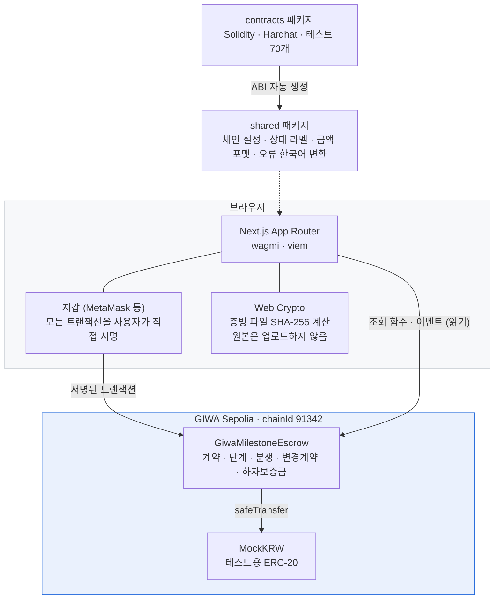

# GIWA Trust Escrow

> **돈은 먼저 안전하게 맡기고, 일한 만큼 단계별로 지급하는 서비스 거래 보호 플랫폼**

고객이 서비스 대금 전액을 스마트컨트랙트에 예치하고, 업체가 합의된 작업 단계의 완료 증빙을 제출하면 고객 승인에 따라 **해당 단계의 대금만** 지급합니다. 분쟁이 생기면 그 금액을 동결하고 사전에 지정된 중재자가 배분을 결정합니다.

첫 적용 사례는 **주거 인테리어 공사**이며, 개발 외주·디자인/영상 제작·맞춤 제작·수리 설치·B2B 납품처럼 단계별 이행 확인이 필요한 모든 서비스 거래로 확장할 수 있습니다.

> ⚠️ **현재는 GIWA Sepolia 테스트넷 MVP입니다.** 화면의 `mKRW`는 테스트용 ERC-20이며 실제 원화·예금·전자화폐 어느 것과도 교환되지 않습니다. 실제 은행 예치, 원화 결제, 이자 지급, 법적 중재는 MVP 범위 밖입니다.

---

## 1. 해결하는 문제

인테리어 공사에서 반복되는 분쟁 구조입니다.

| 문제 | 지금 | GIWA Trust Escrow |
|---|---|---|
| 고객이 결과를 보기 전에 대금 대부분을 지급 | 계약금·중도금 선지급 | 전액 예치하되 **단계별로만** 지급 |
| 업체는 자재비·인건비 때문에 선금이 필요 | 구두 신뢰에 의존 | 대금이 컨트랙트에 **실제로 잠겨 있음**을 확인 가능 |
| 추가 작업과 추가금이 구두로 합의됨 | 기록 없음 | 변경계약으로 양측 승인 기록 |
| 고객이 이유 없이 승인을 미룸 | 대응 수단 없음 | 보완 요청 → 분쟁 → 중재 절차 |
| 분쟁 시 누가 얼마를 들고 있는지 불명확 | 다툼 | 계약별 잔액이 온체인에 공개 |
| 잔금 지급 후 하자보수 지연 | 회수 불가 | 하자보증금을 기간 동안 별도 잠금 |

기존 단일 완료형 에스크로는 전체 거래가 끝나야 지급합니다. 인테리어처럼 자재 구매 → 철거 → 목공 → 준공 → 하자보수로 이어지는 서비스에는 **단계별 지급 · 변경계약 · 분쟁 동결 · 하자보증금**이 함께 필요합니다.

---

## 2. 핵심 기능

- **전액 예치, 단계별 지급** — 총액을 한 번에 잠그고 승인된 단계 금액만 업체에게 전송
- **작업 증빙 해시 기록** — 파일은 업로드하지 않고 브라우저에서 계산한 SHA-256만 온체인 기록
- **보완 요청** — 승인 대신 사유와 함께 재작업 요청, 업체는 새 증빙으로 재제출
- **분쟁 동결과 중재** — 제기 즉시 해당 금액 동결, 중재자가 업체 지급분 : 고객 환불분으로 정확히 분할
- **변경계약** — 추가 작업을 제안 → 상대방 승인 → 고객 추가금 예치 → 새 단계 생성
- **하자보증금** — 마지막 단계를 잠금 기간 동안 별도 보관, 기간 종료 후에만 지급
- **상호 합의 취소** — 양측 동의 시 미지급 잔액 전액을 고객에게 환불 (지급분은 회수하지 않음)
- **긴급 일시정지** — 관리자는 신규 계약·자금 이동만 멈출 수 있고, **예치금을 인출할 수는 없음**

---

## 3. GIWA를 선택한 이유

**국내 서비스에 필요한 신뢰 기반.** 이 제품은 거래 당사자의 자금을 다루므로 초기 신뢰 확보가 결정적입니다. 업비트와 연결된 GIWA 생태계는 국내 사용자의 초기 신뢰 형성, 향후 GIWA Wallet 연동, 국내 금융기관·결제사업자와의 협력 가능성을 높이는 전략적 기반이 될 수 있습니다.

> 다만 업비트 고객 자동 확보, 은행 제휴 직접 지원, 거래지원 연계, GIWA Wallet 탑재 확정 등은 **보장된 사실이 아니며 그렇게 표현하지 않습니다.**

**다단계 상태 변경에 적합한 비용과 속도.** 계약 하나에서 생성·예치·제출·승인·거절·변경계약·분쟁·지급까지 여러 트랜잭션이 발생합니다. GIWA의 EVM 호환성과 빠른 블록 생성은 이런 반복적 상태 변경에 적합합니다.

**생태계와의 장기 결합.** GIWA Wallet 내 계약·지급 관리, Dojang 기반 사업자·중재자 인증, Upbit Web3 Names를 이용한 사용자 식별, 스테이블코인 결제와 가스비 대납, 다른 GIWA 앱이 쓰는 에스크로 SDK로 확장할 수 있게 설계했습니다. **MVP는 이 기능들을 필수 의존성으로 두지 않고 일반 EVM 지갑만으로 동작합니다.**

---

## 4. 아키텍처



**온체인이 진실의 원천입니다.** 서버·데이터베이스·인덱서가 없습니다. 화면은 컨트랙트 조회 함수와 이벤트만으로 구성됩니다.

- 표시용 메타데이터(계약명·단계명)는 온체인 `metadataURI` 에 JSON 으로 담고, 무결성 확인용 해시를 함께 기록합니다.
- 사람이 읽는 설명문(승인 메모·보완 사유·분쟁 사유)은 상태에 저장하지 않고 `MilestoneNote` **이벤트 로그에만** 남겨 저장 비용과 노출 범위를 줄입니다.

**온체인이 진실의 원천입니다.** 별도 백엔드나 인덱서 없이 컨트랙트 조회 함수와 이벤트만으로 모든 화면을 구성합니다.

| 데이터 | 저장 위치 |
|---|---|
| 지갑 주소, 금액, 단계별 상태, 타임스탬프 | 온체인 상태 |
| 계약명, 단계명 (표시용) | 온체인 `metadataURI` (JSON) + 해시 |
| 승인·보완·분쟁 사유 등 설명문 | 이벤트 로그 (`MilestoneNote`) — 상태 저장 안 함 |
| 증빙 사진·PDF | **온체인은 SHA-256 해시만.** 원본은 당사자가 직접 보관 |
| 은행 계좌, 실명, 주소, 전화번호 | **저장하지 않음** |

### 저장소 구조

```
giwa-trust-escrow/
├─ apps/web/              Next.js 프론트엔드
├─ packages/
│  ├─ contracts/          Solidity + Hardhat 3 + 테스트
│  └─ shared/             체인 설정, ABI(자동 생성), 포맷·상태·오류 변환
├─ .env.example
└─ pnpm-workspace.yaml
```

---

## 5. 스마트컨트랙트 주소

**네트워크: GIWA Sepolia (chainId 91342)** · 배포일 2026-07-31 · 두 컨트랙트 모두 **소스 검증 완료**

| 컨트랙트 | 주소 |
|---|---|
| `MockKRW` | [`0x0011820085d2a60b902537b504a9767482a7f2b4`](https://sepolia-explorer.giwa.io/address/0x0011820085d2a60b902537b504a9767482a7f2b4#code) |
| `GiwaMilestoneEscrow` | [`0x649050b15a61f3690c8a07857203e6f1ec72c3a5`](https://sepolia-explorer.giwa.io/address/0x649050b15a61f3690c8a07857203e6f1ec72c3a5#code) |

관리자(`Ownable2Step` owner): `0x03f317229ab926fad80b5c4f0a683999cd043dbd` — `pause`/`unpause` 만 가능하며 예치금을 인출할 수 없습니다.

배포 기록은 `packages/shared/src/deployments/giwa-sepolia.json` 에 자동 저장됩니다.

## 6. 라이브 데모

**https://giwa-trust-escrow-web.vercel.app**

지갑 없이도 계약 상세 화면은 읽기 전용으로 열람할 수 있습니다. 직접 만들어 보려면:

1. [GIWA faucet](https://faucet.giwa.io/) 에서 가스비용 테스트 ETH 수령
2. 서비스의 **테스트 토큰** 화면에서 mKRW 수령
3. **계약 만들기** → 인테리어 템플릿 선택 → 생성·승인·예치

업체·중재자 역할까지 보려면 지갑에서 계정을 하나씩 더 만들어 전환하면 됩니다.

### 실제 온체인 기록 (데모 계약 #0)

돈이 실제로 단계별로 움직인 트랜잭션입니다. 모두 GIWA Sepolia 에서 확인할 수 있습니다.

| 동작 | 실행 지갑 | 트랜잭션 |
|---|---|---|
| 계약금 5,000만 mKRW 전액 예치 | 고객 | [`0xd02d9824…`](https://sepolia-explorer.giwa.io/tx/0xd02d9824b33d4c6115a19f9d7556b62c32a6b4c585dc180680e578874fa9ea1d) |
| 1단계 완료 증빙 제출 (파일 해시) | 업체 | [`0x860da42a…`](https://sepolia-explorer.giwa.io/tx/0x860da42abe84a68c85845fd63288c955ae3264dcc84b1fbde848326bd7eb77a1) |
| 1단계 승인 → 1,000만 mKRW 지급 | 고객 | [`0x9cb2742c…`](https://sepolia-explorer.giwa.io/tx/0x9cb2742c1e1deb73143090c618e4dd68606942393906e38e0d07656ef5785e80) |

승인 트랜잭션 한 건으로 **1,000만 mKRW 만** 업체에게 나가고 나머지 **4,000만 mKRW 는 컨트랙트에 그대로 잠겨** 있습니다. 이것이 이 제품의 핵심 동작입니다.

| 역할 | 주소 |
|---|---|
| 고객 | `0x03F317229ab926fAd80B5C4f0a683999cD043dbd` |
| 업체 | `0xe266A82DF10EC793c275D630973bE32aACD81fD6` |
| 중재자 | `0x5f67FD8Bd30D7110CC49EDD17C66CeBb310CAaDD` |

---

## 7. 로컬 실행

```bash
git clone <this-repo> && cd giwa-trust-escrow
pnpm install
```

```bash
cp .env.example packages/contracts/.env
```

`packages/contracts/.env` 에 테스트넷 전용 지갑의 `DEPLOYER_PRIVATE_KEY` 를 넣습니다. 가스비용 테스트 ETH 는 https://faucet.giwa.io 에서 받습니다.

```bash
pnpm --filter contracts compile
pnpm --filter contracts test
pnpm deploy:giwa
```

배포가 끝나면 출력된 두 주소를 `apps/web/.env.local` 에 넣습니다.

```bash
NEXT_PUBLIC_ESCROW_CONTRACT_ADDRESS=0x...
NEXT_PUBLIC_MOCK_KRW_ADDRESS=0x...
```

```bash
pnpm dev
```

---

## 8. 환경변수

`.env.example` 참고. 요약하면 다음과 같습니다.

| 변수 | 위치 | 설명 |
|---|---|---|
| `NEXT_PUBLIC_GIWA_RPC_URL` | web | 공개 RPC 대신 쓸 엔드포인트 (rate limit 회피) |
| `NEXT_PUBLIC_ESCROW_CONTRACT_ADDRESS` | web | 배포된 에스크로 주소 |
| `NEXT_PUBLIC_MOCK_KRW_ADDRESS` | web | 배포된 테스트 토큰 주소 |
| `DEPLOYER_PRIVATE_KEY` | contracts | **contracts 패키지에서만 읽힘.** 클라이언트 번들에 포함되지 않음 |
| `DEMO_PROVIDER_ADDRESS` / `DEMO_ARBITER_ADDRESS` | contracts | 데모 계약 시딩용 |

`.env*` 는 `.gitignore` 되어 있고 `.env.example` 만 커밋됩니다.

---

## 9. 테스트

```bash
pnpm --filter contracts test
```

**70개 테스트 통과.** 명세서 15장의 항목을 모두 덮습니다.

| 영역 | 내용 |
|---|---|
| MockKRW | 소수점 6자리, 초기 물량, faucet 지급·쿨다운·관리자 권한 |
| 계약 생성 | zero address, 역할 중복, 단계 수 1개/11개, 금액 0, 배열 길이 불일치, 하자보증금 2개·위치·해제일, 예정일 역순 |
| 예치 | 고객 전액 예치, 업체 시도 차단, allowance 부족, 중복 예치 |
| 제출·승인 | 순서 건너뛰기 차단, 증빙 해시 0 차단, 권한 검증, 중복 승인 차단, 잔액 이동 검증 |
| 보완 요청 | 재제출 → 승인, 제3자 차단 |
| 분쟁 | 양측 제기, 지급 차단, 중재자 외 차단, 합계 불일치 차단, 70:30 / 100:0 / 0:100 배분, 해결 후 진행 재개 |
| 변경계약 | 제안·자기승인 차단·상대 승인·추가금 예치·새 단계 생성, 하자보증금 진행 후 차단 |
| 하자보증금 | 잠금 전 지급 실패, 잠금 후 지급 및 완료 이벤트, 분쟁 시 지급 차단 |
| 취소 | 상호 합의 환불, 제안자 자기수락 차단, 분쟁 중 차단, 제3자 차단, **제안 철회·거절**, **취소 제안으로 이의 제기를 막을 수 없음** |
| 관리자 | 일시정지·해제, 권한 검증, **상태 변경 함수 허용목록 고정**, **관리자가 예치금을 빼낼 수 없음** |
| 회계 불변조건 | 매 시나리오마다 `컨트랙트 토큰 잔액 == Σ(예치 − 지급 − 환불)` 확인 |

---

## 10. 배포와 소스 검증

```bash
pnpm deploy:giwa
```

소스 검증은 GIWA 공식 Blockscout 익스플로러에 합니다.

```bash
npx hardhat verify --network giwaSepolia <컨트랙트주소> <관리자주소>
```

> GIWA(91342)는 아직 Sourcify·Etherscan 에 등록되어 있지 않아 두 provider 는 꺼두었습니다.

데모 계약 시딩 (선택):

```bash
pnpm --filter contracts seed:giwa
```

---

## 11. 데모 계정 역할

데모는 지갑 3개로 진행합니다.

| 역할 | 하는 일 |
|---|---|
| **고객 (Client)** | 계약 생성, 전액 예치, 증빙 확인, 승인/보완 요청/분쟁 제기, 변경계약 승인과 추가금 예치 |
| **업체 (Provider)** | 증빙 제출, 보완 후 재제출, 변경계약 제안, 분쟁 제기, 대금 수령 |
| **중재자 (Arbiter)** | 분쟁 계약 확인 후 업체 지급분과 고객 환불분 결정 |

데모 계약 (명세서 17장):

| 순서 | 단계 | 금액 | 비율 |
|---|---|---:|---:|
| 1 | 자재 발주 및 작업 착수 | 10,000,000 mKRW | 20% |
| 2 | 철거·설비·전기 기초공사 | 10,000,000 mKRW | 20% |
| 3 | 목공·타일·주요 시공 | 15,000,000 mKRW | 30% |
| 4 | 준공 및 최종검수 | 10,000,000 mKRW | 20% |
| 5 | 하자보증금 | 5,000,000 mKRW | 10% |

테스트넷 데모에서는 하자보증 잠금을 **5분**으로 설정할 수 있습니다 (실제 서비스 기본안은 30일 이상).

---

## 12. 보안 설계

**불변조건**

1. 계약별 잔액은 항상 `totalFunded − totalReleased − totalRefunded` 와 일치
2. 지급액 + 환불액은 예치액을 초과할 수 없음
3. 같은 단계는 두 번 지급될 수 없음 (`Paid`/`Resolved` 는 종료 상태)
4. 분쟁 상태의 단계는 일반 승인으로 지급 불가
5. 중재 결과 두 금액의 합은 분쟁 금액과 **정확히** 일치해야 함
6. 계약 당사자 주소는 생성 후 변경 불가

**적용한 방어**

- `SafeERC20` 로 모든 토큰 전송
- 외부 전송이 있는 모든 함수에 `ReentrancyGuard`
- 수수료 부과형 토큰이 회계를 깨지 않도록 예치 시 실제 증가분 검증
- `Ownable2Step` — 관리자 이전 시 수락 단계 필요
- 업그레이드 프록시 미사용 — 단순성과 감사 용이성 우선

**관리자가 할 수 없는 것**

임의 출금, 계약금액 수정, 당사자·중재자 변경, 사용자 대신 승인, 분쟁 결과 결정. 테스트로 검증합니다 (`관리자는 예치금을 빼낼 수 있는 함수를 갖고 있지 않다`).

---

## 13. MVP에서 제외한 실제 금융 기능

실제 원화 계좌이체, 은행 에스크로 계좌, 예금 이자, DeFi 운용, 법적 효력을 보장하는 전자계약, 자동 하자 판정, AI 사진 판독, 실명확인·사업자 인증, 카드 결제·PG, VASP 기능, 메인넷 실자금 운영, 다중 통화, DAO 중재.

### 예치금과 이자에 대한 입장

| 단계 | 자금 보관 |
|---|---|
| 현재 MVP | GIWA Sepolia 컨트랙트에 MockKRW 예치. 실제 가치·이자 없음 |
| 실제 서비스 1단계 | 등록된 은행·PG·에스크로 파트너의 분리계좌. GIWA는 계약·승인·지급 조건 관리 |
| 향후 | 규제 적합 스테이블코인 또는 토큰화 예금과 직접 연결 |

이자 배분 방식(고객 환급형 / 수수료 차감형 / 고객·업체 분배형 / 보증기금 적립형 / 혼합형)은 **MVP에서 확정하지 않습니다.** 금융기관 협의, 규제 검토, 사용자 인터뷰를 거쳐 결정합니다. 이자는 부가가치이며 핵심은 원금 안전과 단계별 지급입니다.

---

## 14. 알려진 제한사항

- 조회 함수가 배열을 통째로 반환하므로 계약 수가 많아지면 확장성 문제가 있습니다. 메인넷 단계에서는 이벤트 인덱서로 대체합니다. MVP는 단계 수를 20개로 제한합니다.
- 공개 RPC에 rate limit이 있습니다. `NEXT_PUBLIC_GIWA_RPC_URL` 로 교체할 수 있습니다.
- 증빙 파일 원본 저장소(Supabase Storage)는 붙이지 않았습니다. 현재는 해시만 기록하고 원본은 당사자가 직접 주고받습니다.
- 중재자는 계약 생성 시 지정하는 단일 주소입니다. 전문가 중재 네트워크는 로드맵 3단계입니다.
- **중재자가 응답하지 않으면 분쟁 금액이 계속 잠겨 있습니다.** 중재 기한과 대체 중재자 지정은 다음 단계 과제입니다.
- 고객이 승인도 분쟁 제기도 하지 않고 방치하는 경우의 자동 승인 기한 규칙은 아직 없습니다. 업체는 분쟁 제기로 중재 절차를 시작할 수 있습니다.

### 배포 전 자체 감사에서 고친 것

취소 제안이 계약을 영구히 묶을 수 있었습니다. `proposeCancellation` 이 상태를 `CancelPending` 으로 바꾸는데 되돌릴 방법이 없었고, 작업 진행·승인·**분쟁 제기**가 모두 `Active` 를 요구했습니다. 그래서 고객이 승인 대신 취소를 제안하면 업체는 이의를 제기할 수단이 없고, 취소를 수락해 미지급 잔액 전액을 고객에게 돌려주거나 자금을 영원히 묶어두는 선택지밖에 없었습니다.

두 가지로 막았습니다.

1. `withdrawCancellation` — 제안자와 상대방 모두 계류 중인 취소 제안을 물릴 수 있고 계약은 `Active` 로 복귀합니다.
2. `raiseDispute` 를 `CancelPending` 상태에서도 허용하고, 분쟁이 시작되면 계류 중인 취소 제안을 무효화합니다.

`취소 제안만으로 상대방의 이의 제기를 막을 수 없다` 테스트가 이 시나리오를 그대로 재현해 고정합니다.

---

## 15. 로드맵

| 단계 | 내용 |
|---|---|
| 1. GIWA Testnet MVP | 마일스톤 에스크로, 변경계약, 분쟁, 하자보증금, 인테리어 데모 ← **현재** |
| 2. 금융 파트너 PoC | 은행·PG·에스크로 사업자 협의, 분리계좌, 온체인 지급 이벤트 ↔ 오프체인 송금 연결, 이자 배분 모델 결정 |
| 3. 인테리어 실증 | 소규모 업체와 제한적 PoC, 표준 마일스톤·변경계약 템플릿, 전문가 중재 네트워크 |
| 4. GIWA 생태계 확장 | GIWA Wallet 인앱 경험, Dojang 사업자·중재자 증명, Upbit Web3 Names, 가스비 대납, SDK/API |
| 5. 범용 서비스 거래 인프라 | 개발 외주, 맞춤 제작, B2B 납품, 영상·디자인, 수리·설치, 화이트라벨 에스크로 |
| 6. 선택형 하이브리드 운용 | 충분한 규제 검토 후 명시적 opt-in 기반으로만 검토 |

---

## 16. 참고

- GIWA 공식 사이트 — https://giwa.io/
- GASOK — https://giwa.io/gasok
- GIWA Documentation — https://docs.giwa.io/
- GIWA Sepolia 연결 정보 — https://docs.giwa.io/get-started/connect-to-giwa
- Hardhat 개발 가이드 — https://docs.giwa.io/get-started/smart-contract/develop/hardhat
- Faucet — https://faucet.giwa.io/
- Explorer — https://sepolia-explorer.giwa.io/

---

## 최종 제품 메시지

> GIWA Trust Escrow는 고객의 돈을 무조건 업체에게 먼저 보내거나, 업체가 일을 끝내고도 돈을 받지 못하는 양자택일을 없앱니다. 고객은 전체 계약금을 안전하게 예치하고, 업체는 합의된 작업을 완료할 때마다 대금을 지급받습니다. 추가 작업, 분쟁, 하자보증금까지 하나의 계약 흐름으로 기록해 서비스 거래의 신뢰를 높입니다.
