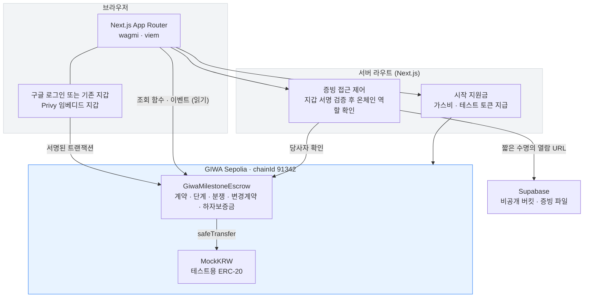

# GIWA Trust Escrow

> **대금은 먼저 안전하게 맡기고, 약속이 지켜진 만큼만 단계적으로 지급하는 거래 보호 플랫폼**

구매자가 대금 전액을 스마트컨트랙트에 예치하고, 공급자가 합의된 단계의 완료 증빙을 제출하면 구매자 승인에 따라 **해당 단계의 대금만** 지급합니다. 분쟁이 생기면 그 금액을 동결하고 사전에 지정된 중재자가 배분을 결정합니다.

첫 적용 사례는 **주거 인테리어 공사**이며, 단계로 나눌 수 있는 거래라면 어디에나 쓸 수 있습니다.

> ⚠️ **현재는 GIWA Sepolia 테스트넷 MVP입니다.** 화면의 `mKRW`는 테스트용 ERC-20이며 실제 원화·예금·전자화폐 어느 것과도 교환되지 않습니다. 실제 은행 예치, 원화 결제, 이자 지급, 법적 중재는 MVP 범위 밖입니다.

---

## 1. 해결하는 문제

**선불과 후불, 어느 쪽도 안전하지 않습니다.**

| | 위험을 지는 쪽 | 무슨 일이 생기나 |
|---|---|---|
| **선불** | 구매자 | 결과물이 계약 내용과 달라도 대금은 이미 넘어간 뒤입니다. 시정을 요구할 수단이 마땅치 않고, 환불과 보상 협의에서 불리한 위치에 놓입니다. |
| **후불** | 공급자 | 자재 구입과 인건비 등 착수 비용을 자체 자금으로 먼저 집행해야 합니다. 약속된 대금이 지급되지 않으면 공급자는 손실을 그대로 떠안게 됩니다. |

대금은 계약 시점에 전액 예치되어 어느 쪽도 임의로 사용할 수 없습니다. 합의한 조건이 충족될 때마다 사전에 약속된 금액이 단계적으로 지급됩니다. 공급자는 대금이 확보된 것을 확인하고 작업에 착수하고, 구매자는 약속된 결과물을 받기 전까지 금액을 계속 보호받습니다.

기존 단일 완료형 에스크로는 전체 거래가 끝나야 지급합니다. 인테리어처럼 자재 구매 → 철거 → 목공 → 준공 → 하자보수로 이어지는 거래에는 **단계별 지급 · 변경계약 · 분쟁 동결 · 하자보증금**이 함께 필요합니다.

### 적용 범위

| 유형 | 예시 | 흐름 | 지금 가능한가 |
|---|---|---|---|
| 서비스 거래 | 인테리어, 개발 외주, 영상 제작 | 공정 단위로 완료를 확인하고 해당 단계 대금만 지급 | ✅ |
| 물품 거래 | 중고 거래, B2B 납품 | 대금이 예치된 상태에서 발송하고, 수령 확인 후 지급 | ✅ |
| 정기 지급 | 성과급 분할, 토큰 베스팅 | 약정한 일자가 도래하면 수령 측이 직접 수령 | ⏳ 준비 중 |

정기 지급은 **승인 없이 날짜만으로** 지급되는 구조라 현재 컨트랙트로는 동작하지 않습니다. 시간 기반 단계를 추가하는 컨트랙트 변경이 필요합니다.

---

## 2. 핵심 기능

**거래**

- **전액 예치, 단계별 지급** — 총액을 한 번에 잠그고 승인된 단계 금액만 공급자에게 전송
- **증빙 제출과 확인** — 공급자가 사진·문서를 올리면 구매자가 화면에서 바로 보고 승인 여부를 판단
- **보완 요청** — 승인 대신 사유와 함께 재작업 요청, 공급자는 새 증빙으로 재제출
- **분쟁 동결과 중재** — 제기 즉시 해당 금액 동결, 중재자가 공급자 지급분 : 구매자 환불분으로 정확히 분할
- **변경계약** — 추가 작업을 제안 → 상대방 승인 → 구매자 추가금 예치 → 새 단계 생성
- **하자보증금** — 마지막 단계를 잠금 기간 동안 별도 보관, 기간 종료 후에만 지급
- **상호 합의 취소** — 양측 동의 시 미지급 잔액 전액을 구매자에게 환불 (지급분은 회수하지 않음)
- **긴급 일시정지** — 관리자는 신규 계약·자금 이동만 멈출 수 있고, **예치금을 인출할 수는 없음**

**진입 장벽 제거** — 블록체인을 모르는 사람도 쓸 수 있어야 의미가 있습니다.

- **구글 로그인** — 지갑 설치도, 시드 구문도 없이 시작. 로그인하면 지갑이 자동으로 만들어집니다
- **가스비 자동 지급** — 신규 사용자에게 서버가 가스비와 테스트 토큰을 넣어줍니다. faucet 을 찾아다닐 필요가 없습니다
- **기존 지갑도 그대로** — 메타마스크·OKX 등 EIP-6963 지갑을 쓰던 사용자는 그대로 연결
- **한국어 우선** — 화면에 `Deposit`, `Release` 대신 `계약금 예치`, `업체에게 지급` 을 씁니다. 지갑·RPC·컨트랙트 오류도 한국어로 바꿔 보여줍니다

---

## 3. GIWA를 선택한 이유

**국내 서비스에 필요한 신뢰 기반.** 이 제품은 거래 당사자의 자금을 다루므로 초기 신뢰 확보가 결정적입니다. 업비트와 연결된 GIWA 생태계는 국내 사용자의 초기 신뢰 형성, 향후 GIWA Wallet 연동, 국내 금융기관·결제사업자와의 협력 가능성을 높이는 전략적 기반이 될 수 있습니다.

> 다만 업비트 고객 자동 확보, 은행 제휴 직접 지원, 거래지원 연계, GIWA Wallet 탑재 확정 등은 **보장된 사실이 아니며 그렇게 표현하지 않습니다.**

**다단계 상태 변경에 적합한 비용과 속도.** 계약 하나에서 생성·예치·제출·승인·거절·변경계약·분쟁·지급까지 여러 트랜잭션이 발생합니다. GIWA의 EVM 호환성과 빠른 블록 생성은 이런 반복적 상태 변경에 적합합니다.

**생태계와의 장기 결합.** GIWA Wallet 내 계약·지급 관리, Dojang 기반 사업자·중재자 인증, Upbit Web3 Names를 이용한 사용자 식별, 스테이블코인 결제와 가스비 대납, 다른 GIWA 앱이 쓰는 에스크로 SDK로 확장할 수 있게 설계했습니다. **MVP는 이 기능들을 필수 의존성으로 두지 않고 일반 EVM 지갑만으로 동작합니다.**

---

## 4. 아키텍처



**계약 상태는 화면이 컨트랙트에서 직접 읽습니다.** 금액과 진행 상황을 중간에서 다르게 보여줄 수 있는 지점이 없습니다. 서버는 계약 상태에 관여하지 않고, 파일 접근 제어와 시작 지원금만 처리합니다.

- 표시용 메타데이터(계약명·단계명)는 온체인 `metadataURI` 에 JSON 으로 담고, 무결성 확인용 해시를 함께 기록합니다.
- 사람이 읽는 설명문(승인 메모·보완 사유·분쟁 사유)은 상태에 저장하지 않고 `MilestoneNote` **이벤트 로그에만** 남겨 저장 비용과 노출 범위를 줄입니다.

| 데이터 | 저장 위치 |
|---|---|
| 지갑 주소, 금액, 단계별 상태, 타임스탬프 | 온체인 상태 |
| 계약명, 단계명 (표시용) | 온체인 `metadataURI` (JSON) + 해시 |
| 승인·보완·분쟁 사유 등 설명문 | 이벤트 로그 (`MilestoneNote`) — 상태 저장 안 함 |
| 증빙 사진·PDF | Supabase **비공개 버킷**. 온체인에는 SHA-256 해시만 |
| 은행 계좌, 실명, 주소, 전화번호 | **저장하지 않음** |

### 증빙 파일 접근 제어

현장 사진에는 집 내부처럼 민감한 정보가 담깁니다. 버킷은 비공개이고, 서버가 요청마다 다음을 확인한 뒤에만 짧은 수명의 열람 URL 을 내줍니다.

1. 지갑 서명이 유효한가 (본인이 맞는가)
2. 서명 문구에 담긴 계약·단계·동작·시각이 이 요청과 일치하는가 (다른 요청의 서명을 재사용하지 못하게)
3. 온체인 `getAgreement` 조회 결과 이 지갑이 해당 계약의 당사자인가

올리는 것은 공급자만, 보는 것은 구매자·공급자·중재자만 가능합니다. 브라우저가 주장하는 역할은 믿지 않습니다.

### 저장소 구조

```
giwa-trust-escrow/
├─ apps/web/              Next.js 프론트엔드 + 서버 라우트
├─ packages/
│  ├─ contracts/          Solidity + Hardhat 3 + 테스트
│  └─ shared/             체인 설정, ABI(자동 생성), 포맷·상태·오류 변환
├─ supabase/              스키마와 설정 안내
├─ .env.example
└─ pnpm-workspace.yaml
```

---

## 5. 스마트컨트랙트 주소

**네트워크: GIWA Sepolia (chainId 91342)** · 배포일 2026-07-31 · 두 컨트랙트 모두 **소스 검증 완료**

| 컨트랙트 | 주소 |
|---|---|
| `MockKRW` | [`0x0011820085d2a60b902537b504a9767482a7f2b4`](https://sepolia-explorer.giwa.io/address/0x0011820085d2a60b902537b504a9767482a7f2b4#code) |
| `GiwaMilestoneEscrow` | [`0x649050b15a61f3690c8a07857203e6f1ec72c3a5`](https://sepolia-explorer.giwa.io/address/0x649050b15a61f3690c8a07857203e6f1ec72c3a5#code) |

관리자(`Ownable2Step` owner): `0x03f317229ab926fad80b5c4f0a683999cd043dbd` — `pause`/`unpause` 만 가능하며 예치금을 인출할 수 없습니다.

배포 기록은 `packages/shared/src/deployments/giwa-sepolia.json` 에 자동 저장됩니다.

## 6. 라이브 데모

**https://giwa-trust-escrow-web.vercel.app**

**구글 계정만 있으면 바로 써볼 수 있습니다.**

1. **시작하기** → 구글 로그인 (지갑 설치·시드 구문 없음)
2. 지갑이 자동으로 만들어지고, 가스비와 테스트 토큰이 자동으로 들어옵니다
3. **계약 만들기** → 인테리어 템플릿 선택 → 생성·승인·예치

기존에 쓰던 메타마스크·OKX 지갑으로도 로그인할 수 있습니다. 계약 상세 화면은 로그인 없이 읽기 전용으로 열람됩니다.

공급자·중재자 역할까지 보려면 지갑에서 계정을 하나씩 더 만들어 전환하면 됩니다.

### 실제 온체인 기록 (데모 계약 #0)

돈이 실제로 단계별로 움직인 트랜잭션입니다. 모두 GIWA Sepolia 에서 확인할 수 있습니다.

| 동작 | 실행 지갑 | 트랜잭션 |
|---|---|---|
| 계약금 5,000만 mKRW 전액 예치 | 구매자 | [`0xd02d9824…`](https://sepolia-explorer.giwa.io/tx/0xd02d9824b33d4c6115a19f9d7556b62c32a6b4c585dc180680e578874fa9ea1d) |
| 1단계 완료 증빙 제출 | 공급자 | [`0x860da42a…`](https://sepolia-explorer.giwa.io/tx/0x860da42abe84a68c85845fd63288c955ae3264dcc84b1fbde848326bd7eb77a1) |
| 1단계 승인 → 1,000만 mKRW 지급 | 구매자 | [`0x9cb2742c…`](https://sepolia-explorer.giwa.io/tx/0x9cb2742c1e1deb73143090c618e4dd68606942393906e38e0d07656ef5785e80) |

승인 트랜잭션 한 건으로 **1,000만 mKRW 만** 공급자에게 나가고 나머지는 **컨트랙트에 그대로 잠겨** 있습니다. 이것이 이 제품의 핵심 동작입니다.

이후 데모 계약에서는 변경계약(추가 작업 30만), 분쟁 제기와 **중재자의 70:30 배분**, 증빙 파일 업로드까지 실제로 진행했습니다. 계약 상세 화면의 `자금 흐름` 과 `활동 내역` 에서 전체 이력을 볼 수 있습니다.

| 역할 | 주소 |
|---|---|
| 구매자 | `0x03F317229ab926fAd80B5C4f0a683999cD043dbd` |
| 공급자 | `0xe266A82DF10EC793c275D630973bE32aACD81fD6` |
| 중재자 | `0x5f67FD8Bd30D7110CC49EDD17C66CeBb310CAaDD` |

---

## 7. 로컬 실행

```bash
git clone <this-repo> && cd giwa-trust-escrow
pnpm install
```

```bash
cp .env.example packages/contracts/.env
```

`packages/contracts/.env` 에 테스트넷 전용 지갑의 `DEPLOYER_PRIVATE_KEY` 를 넣습니다. 가스비용 테스트 ETH 는 https://faucet.giwa.io 에서 받습니다.

```bash
pnpm --filter contracts compile
pnpm --filter contracts test
pnpm deploy:giwa
```

배포가 끝나면 출력된 두 주소를 `apps/web/.env.local` 에 넣습니다.

```bash
NEXT_PUBLIC_ESCROW_CONTRACT_ADDRESS=0x...
NEXT_PUBLIC_MOCK_KRW_ADDRESS=0x...
```

```bash
pnpm dev
```

여기까지만 해도 지갑 로그인으로 전체 흐름이 동작합니다. 아래 셋은 선택이며, 설정하지 않으면 **해당 기능만 꺼지고 나머지는 그대로 동작**합니다.

| 기능 | 설정 | 안 하면 |
|---|---|---|
| 구글 로그인 | `NEXT_PUBLIC_PRIVY_APP_ID` ([privy.io](https://privy.io) 무료) | 지갑 로그인만 가능 |
| 증빙 파일 업로드 | `SUPABASE_URL`, `SUPABASE_SERVICE_ROLE_KEY` ([설정 안내](supabase/README.md)) | 공유 링크로 대체 안내 |
| 가스비 자동 지급 | `FAUCET_PRIVATE_KEY` | 사용자가 faucet 에서 직접 수령 |

### 설정 확인

```bash
node apps/web/scripts/check-supabase.mjs
```

```bash
node apps/web/scripts/check-faucet.mjs
```

---

## 8. 환경변수

`.env.example` 참고. 요약하면 다음과 같습니다.

| 변수 | 위치 | 설명 |
|---|---|---|
| `NEXT_PUBLIC_GIWA_RPC_URL` | web | 공개 RPC 대신 쓸 엔드포인트 (rate limit 회피) |
| `NEXT_PUBLIC_ESCROW_CONTRACT_ADDRESS` | web | 배포된 에스크로 주소 |
| `NEXT_PUBLIC_MOCK_KRW_ADDRESS` | web | 배포된 테스트 토큰 주소 |
| `NEXT_PUBLIC_PRIVY_APP_ID` | web | 구글 로그인. 공개 값 |
| `SUPABASE_URL` | web (서버) | 증빙 파일 저장소 |
| `SUPABASE_SERVICE_ROLE_KEY` | web (서버) | ⚠️ **`NEXT_PUBLIC_` 을 붙이면 안 됩니다.** 붙이면 브라우저에 노출되어 누구나 DB 를 조작할 수 있습니다 |
| `FAUCET_PRIVATE_KEY` | web (서버) | 시작 지원금 지갑. **배포 키와 분리하세요** |
| `DEPLOYER_PRIVATE_KEY` | contracts | **contracts 패키지에서만 읽힘.** 클라이언트 번들에 포함되지 않음 |
| `DEMO_PROVIDER_ADDRESS` / `DEMO_ARBITER_ADDRESS` | contracts | 데모 계약 시딩용 |

`.env*` 는 `.gitignore` 되어 있고 `.env.example` 만 커밋됩니다.

**키 분리 원칙** — `FAUCET_PRIVATE_KEY` 에 배포 키를 그대로 쓰지 마세요. 배포 키는 컨트랙트 관리자 권한을 갖고 있어, 서버가 뚫리면 피해 범위가 지원금 잔액을 훨씬 넘어섭니다.

---

## 9. 테스트

```bash
pnpm --filter contracts test
```

**70개 테스트 통과.** 명세서 15장의 항목을 모두 덮습니다.

서버 라우트는 별도 스크립트로 확인합니다. 실제 지갑 키로 서명해 권한 판정이 맞는지 검사합니다.

```bash
node apps/web/scripts/check-evidence-auth.mjs
```

```bash
node apps/web/scripts/check-starter-funds.mjs
```

검사 항목: 제3자 열람 차단, 역할 위반(구매자의 업로드 시도) 차단, 다른 동작·다른 단계의 서명 재사용 차단, 만료·미래 시각 서명 차단, 존재하지 않는 계약, 지원금 중복 지급 차단, 남의 주소로 대신 요청 차단. 배포본을 검사하려면 주소를 인자로 넘깁니다.

| 영역 | 내용 |
|---|---|
| MockKRW | 소수점 6자리, 초기 물량, faucet 지급·쿨다운·관리자 권한 |
| 계약 생성 | zero address, 역할 중복, 단계 수 1개/11개, 금액 0, 배열 길이 불일치, 하자보증금 2개·위치·해제일, 예정일 역순 |
| 예치 | 고객 전액 예치, 업체 시도 차단, allowance 부족, 중복 예치 |
| 제출·승인 | 순서 건너뛰기 차단, 증빙 해시 0 차단, 권한 검증, 중복 승인 차단, 잔액 이동 검증 |
| 보완 요청 | 재제출 → 승인, 제3자 차단 |
| 분쟁 | 양측 제기, 지급 차단, 중재자 외 차단, 합계 불일치 차단, 70:30 / 100:0 / 0:100 배분, 해결 후 진행 재개 |
| 변경계약 | 제안·자기승인 차단·상대 승인·추가금 예치·새 단계 생성, 하자보증금 진행 후 차단 |
| 하자보증금 | 잠금 전 지급 실패, 잠금 후 지급 및 완료 이벤트, 분쟁 시 지급 차단 |
| 취소 | 상호 합의 환불, 제안자 자기수락 차단, 분쟁 중 차단, 제3자 차단, **제안 철회·거절**, **취소 제안으로 이의 제기를 막을 수 없음** |
| 관리자 | 일시정지·해제, 권한 검증, **상태 변경 함수 허용목록 고정**, **관리자가 예치금을 빼낼 수 없음** |
| 회계 불변조건 | 매 시나리오마다 `컨트랙트 토큰 잔액 == Σ(예치 − 지급 − 환불)` 확인 |

---

## 10. 배포와 소스 검증

```bash
pnpm deploy:giwa
```

소스 검증은 GIWA 공식 Blockscout 익스플로러에 합니다.

```bash
npx hardhat verify --network giwaSepolia <컨트랙트주소> <관리자주소>
```

> GIWA(91342)는 아직 Sourcify·Etherscan 에 등록되어 있지 않아 두 provider 는 꺼두었습니다.

데모 계약 시딩 (선택):

```bash
pnpm --filter contracts seed:giwa
```

---

## 11. 데모 계정 역할

데모는 지갑 3개로 진행합니다.

| 역할 | 하는 일 |
|---|---|
| **구매자 (Client)** | 계약 생성, 전액 예치, 증빙 확인, 승인/보완 요청/분쟁 제기, 변경계약 승인과 추가금 예치 |
| **공급자 (Provider)** | 증빙 제출, 보완 후 재제출, 변경계약 제안, 분쟁 제기, 대금 수령 |
| **중재자 (Arbiter)** | 분쟁 계약 확인 후 공급자 지급분과 구매자 환불분 결정 |

> 화면에는 계약 성격에 따라 `고객`·`업체` 로 표시됩니다. 컨트랙트의 `client`·`provider` 와 같은 역할입니다.

데모 계약 (명세서 17장):

| 순서 | 단계 | 금액 | 비율 |
|---|---|---:|---:|
| 1 | 자재 발주 및 작업 착수 | 10,000,000 mKRW | 20% |
| 2 | 철거·설비·전기 기초공사 | 10,000,000 mKRW | 20% |
| 3 | 목공·타일·주요 시공 | 15,000,000 mKRW | 30% |
| 4 | 준공 및 최종검수 | 10,000,000 mKRW | 20% |
| 5 | 하자보증금 | 5,000,000 mKRW | 10% |

테스트넷 데모에서는 하자보증 잠금을 **5분**으로 설정할 수 있습니다 (실제 서비스 기본안은 30일 이상).

---

## 12. 보안 설계

**불변조건**

1. 계약별 잔액은 항상 `totalFunded − totalReleased − totalRefunded` 와 일치
2. 지급액 + 환불액은 예치액을 초과할 수 없음
3. 같은 단계는 두 번 지급될 수 없음 (`Paid`/`Resolved` 는 종료 상태)
4. 분쟁 상태의 단계는 일반 승인으로 지급 불가
5. 중재 결과 두 금액의 합은 분쟁 금액과 **정확히** 일치해야 함
6. 계약 당사자 주소는 생성 후 변경 불가

**적용한 방어**

- `SafeERC20` 로 모든 토큰 전송
- 외부 전송이 있는 모든 함수에 `ReentrancyGuard`
- 수수료 부과형 토큰이 회계를 깨지 않도록 예치 시 실제 증가분 검증
- `Ownable2Step` — 관리자 이전 시 수락 단계 필요
- 업그레이드 프록시 미사용 — 단순성과 감사 용이성 우선

**관리자가 할 수 없는 것**

임의 출금, 계약금액 수정, 당사자·중재자 변경, 사용자 대신 승인, 분쟁 결과 결정. 테스트로 검증합니다 (`관리자는 예치금을 빼낼 수 없다`).

**서버 쪽 방어**

- 증빙 파일 접근은 지갑 서명 + 온체인 당사자 확인을 통과해야 합니다. 브라우저가 주장하는 역할은 믿지 않습니다.
- 서명 문구에 계약·단계·동작·시각·컨트랙트·체인을 모두 담아 다른 요청이나 다른 배포본으로 재사용할 수 없게 했습니다.
- 저장 경로는 서버가 정하고, 기록 시 계약·단계 폴더 안인지와 실제 업로드 여부를 확인합니다.
- `service_role` 키는 `server-only` 로 묶어 브라우저 번들 유입을 막았습니다.
- 시작 지원금은 이미 잔액이 있으면 지급하지 않고, 요청마다 본인 서명을 확인합니다.

---

## 13. MVP에서 제외한 실제 금융 기능

실제 원화 계좌이체, 은행 에스크로 계좌, 예금 이자, DeFi 운용, 법적 효력을 보장하는 전자계약, 자동 하자 판정, AI 사진 판독, 실명확인·사업자 인증, 카드 결제·PG, VASP 기능, 메인넷 실자금 운영, 다중 통화, DAO 중재.

### 예치금과 이자에 대한 입장

| 단계 | 자금 보관 |
|---|---|
| 현재 MVP | GIWA Sepolia 컨트랙트에 MockKRW 예치. 실제 가치·이자 없음 |
| 실제 서비스 1단계 | 등록된 은행·PG·에스크로 파트너의 분리계좌. GIWA는 계약·승인·지급 조건 관리 |
| 향후 | 규제 적합 스테이블코인 또는 토큰화 예금과 직접 연결 |

이자 배분 방식(고객 환급형 / 수수료 차감형 / 고객·업체 분배형 / 보증기금 적립형 / 혼합형)은 **MVP에서 확정하지 않습니다.** 금융기관 협의, 규제 검토, 사용자 인터뷰를 거쳐 결정합니다. 이자는 부가가치이며 핵심은 원금 안전과 단계별 지급입니다.

---

## 14. 알려진 제한사항

- **정기 지급(베스팅)은 아직 동작하지 않습니다.** 승인 없이 날짜만으로 지급되는 구조라 시간 기반 단계를 컨트랙트에 추가해야 합니다.
- 조회 함수가 배열을 통째로 반환하므로 계약 수가 많아지면 확장성 문제가 있습니다. 메인넷 단계에서는 이벤트 인덱서로 대체합니다. MVP는 단계 수를 20개로 제한합니다.
- 공개 RPC에 rate limit이 있고 `eth_getLogs` 를 10만 블록으로 제한합니다. 이벤트 조회는 배포 블록부터 구간을 나눠 읽되 동시 요청을 3개로 묶습니다. 체인이 자랄수록 구간이 늘어나므로, 메인넷 단계에서는 인덱서로 대체해야 합니다.
- 중재자는 계약 생성 시 지정하는 단일 주소입니다. 전문가 중재 네트워크는 로드맵 3단계입니다.
- **중재자가 응답하지 않으면 분쟁 금액이 계속 잠겨 있습니다.** 중재 기한과 대체 중재자 지정은 다음 단계 과제입니다.
- 구매자가 승인도 분쟁 제기도 하지 않고 방치하는 경우의 자동 승인 기한 규칙은 아직 없습니다. 공급자는 분쟁 제기로 중재 절차를 시작할 수 있습니다.
- **시작 지원금은 완전히 보호되지 않습니다.** 지갑을 여러 개 만들어 반복 요청하면 지원금 지갑이 소진됩니다. 테스트넷이고 금액이 사실상 0이라 잔액 확인과 본인 서명까지만 막아두었습니다. 실제 서비스에서는 사용자 인증과 연동해 계정당 1회로 제한해야 합니다.
- 임베디드 지갑은 Privy 가 키를 관리합니다. 진짜 ERC-4337 계정 추상화(스마트 계정·가스 대납)는 GIWA 에 번들러·페이마스터 인프라가 갖춰진 뒤에 검토합니다.

### 배포 전 자체 감사에서 고친 것

취소 제안이 계약을 영구히 묶을 수 있었습니다. `proposeCancellation` 이 상태를 `CancelPending` 으로 바꾸는데 되돌릴 방법이 없었고, 작업 진행·승인·**분쟁 제기**가 모두 `Active` 를 요구했습니다. 그래서 고객이 승인 대신 취소를 제안하면 업체는 이의를 제기할 수단이 없고, 취소를 수락해 미지급 잔액 전액을 고객에게 돌려주거나 자금을 영원히 묶어두는 선택지밖에 없었습니다.

두 가지로 막았습니다.

1. `withdrawCancellation` — 제안자와 상대방 모두 계류 중인 취소 제안을 물릴 수 있고 계약은 `Active` 로 복귀합니다.
2. `raiseDispute` 를 `CancelPending` 상태에서도 허용하고, 분쟁이 시작되면 계류 중인 취소 제안을 무효화합니다.

`취소 제안만으로 상대방의 이의 제기를 막을 수 없다` 테스트가 이 시나리오를 그대로 재현해 고정합니다.

---

## 15. 로드맵

| 단계 | 내용 |
|---|---|
| 1. GIWA Testnet MVP | 마일스톤 에스크로, 변경계약, 분쟁, 하자보증금, 구글 로그인, 인테리어 데모 ← **현재** |
| 2. 정기 지급 | 시간 기반 단계 추가. 성과급 분할, 토큰 베스팅으로 적용 범위 확대 |
| 3. 금융 파트너 PoC | 은행·PG·에스크로 사업자 협의, 분리계좌, 온체인 지급 이벤트 ↔ 오프체인 송금 연결, 이자 배분 모델 결정 |
| 4. 인테리어 실증 | 소규모 업체와 제한적 PoC, 표준 마일스톤·변경계약 템플릿, 전문가 중재 네트워크 |
| 5. GIWA 생태계 확장 | GIWA Wallet 인앱 경험, Dojang 사업자·중재자 증명, Upbit Web3 Names, 가스비 대납, SDK/API |
| 6. 범용 거래 인프라 | 중고 거래, 개발 외주, 맞춤 제작, B2B 납품, 수리·설치, 화이트라벨 에스크로 |
| 7. 선택형 하이브리드 운용 | 충분한 규제 검토 후 명시적 opt-in 기반으로만 검토 |

---

## 16. 참고

- GIWA 공식 사이트 — https://giwa.io/
- GASOK — https://giwa.io/gasok
- GIWA Documentation — https://docs.giwa.io/
- GIWA Sepolia 연결 정보 — https://docs.giwa.io/get-started/connect-to-giwa
- Hardhat 개발 가이드 — https://docs.giwa.io/get-started/smart-contract/develop/hardhat
- Faucet — https://faucet.giwa.io/
- Explorer — https://sepolia-explorer.giwa.io/

---

## 최종 제품 메시지

> GIWA Trust Escrow는 구매자가 돈을 먼저 다 보내거나, 공급자가 일을 끝내고도 돈을 받지 못하는 양자택일을 없앱니다. 구매자는 대금 전액을 안전하게 예치하고, 공급자는 합의한 조건을 충족할 때마다 그만큼 지급받습니다. 추가 작업, 분쟁, 하자보증금까지 하나의 계약 흐름으로 기록해 거래의 신뢰를 높입니다.
